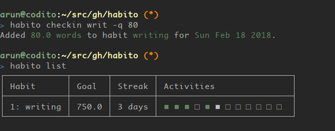

# Habito

Simple command line habits tracker.

[](https://github.com/codito/habito/actions?query=workflow%3Alinux)
[](https://github.com/codito/habito/actions?query=workflow%3Awindows)
[](http://codecov.io/github/codito/habito?branch=master)
[](https://pypi.python.org/pypi/habito)

## Installation

```shell
# Install pipx if needed: `pip install pipx`
# Ensure ~/.local/bin is available in system PATH
pipx install habito
```

Archlinux users may install `habito` from
[AUR](https://aur.archlinux.org/packages/habito/).

## Usage

Here’s how a command line session looks like:

    $ # add a habit
    $ habito add writing 750.0 --units words
    You have commited to 750.0 words of writing every day!

    $ # check in an update
    $ habito checkin writ -q 128.0
    Added 128.0 words to habit writing for Sun Feb 18 2018.

    $ # list status of habits
    $ habito list

## Screenshot

<figure>

<figcaption>Habito screenshot</figcaption>
</figure>

## Contribute

We invite you to try out `habito` and file any issues at github issues
page. Patches are most welcome!
