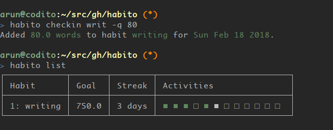

Habito
======

Simple commandline habits tracker.

|Linux Build Status| |Windows Build status| |codecov coverage| |PyPI|

Installation
============

::

    pip install habito

Archlinux users may install ``habito`` from AUR_.

.. _AUR: https://aur.archlinux.org/packages/habito/

Usage
=====

Here’s how a command line session looks like:

::

    $ # add a habit
    $ habito add writing 750.0 --units words
    You have commited to 750.0 words of writing every day!

    $ # check in an update
    $ habito checkin writ -q 128.0
    Added 128.0 words to habit writing for Sun Feb 18 2018.

    $ # list status of habits
    $ habito list

Screenshot
==========

   Habito screenshot

Contribute
==========

We invite you to try out ``habito`` and file any issues at github issues page. Patches are
most welcome!

.. |Linux Build Status| image:: https://github.com/codito/habito/workflows/linux/badge.svg
   :target: https://github.com/codito/habito/actions?query=workflow%3Alinux
.. |Windows Build status| image:: https://github.com/codito/habito/workflows/windows/badge.svg
   :target: https://github.com/codito/habito/actions?query=workflow%3Awindows
.. |codecov coverage| image:: https://img.shields.io/codecov/c/github/codito/habito.svg
   :target: http://codecov.io/github/codito/habito?branch=master
.. |PyPI| image:: https://img.shields.io/pypi/v/habito.svg
   :target: https://pypi.python.org/pypi/habito
